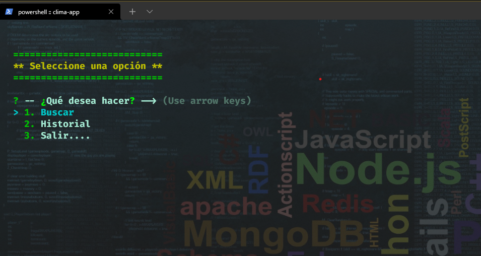
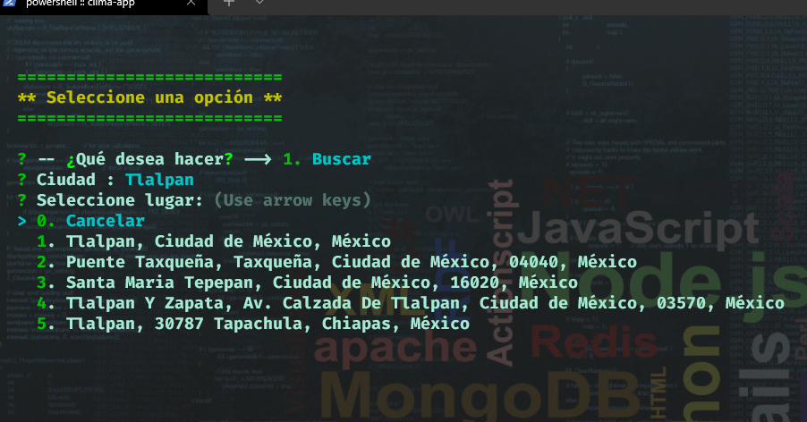
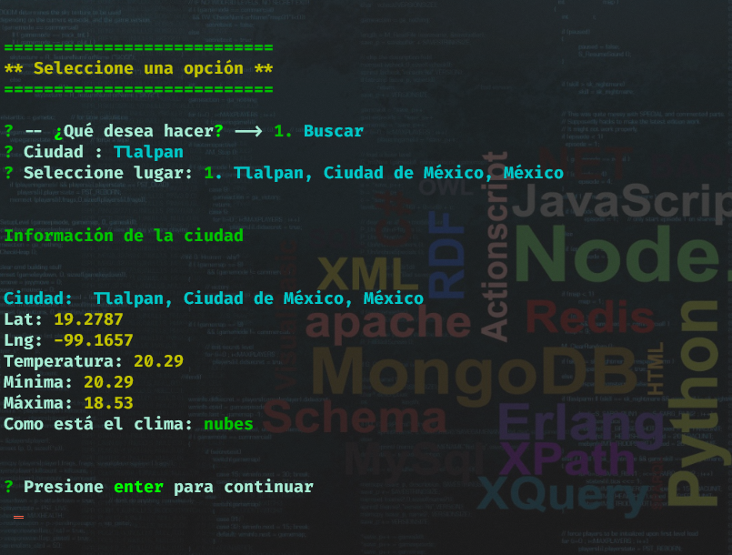
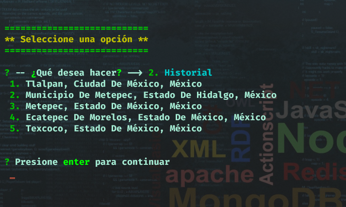

### App de consola - clima

Esta aplicación de consola creada con node.js tiene como funcionalidad realizar búsquedas de lugares a través de su geolocalización y
como resultado de la búsqueda se entrega la información de ubicación geográfica y temperatura.

Para obtener la geolocalización de la búsqueda se hace uso de la api de mapbox (https://www.mapbox.com/).

Para obtener el clima de la búsqueda se hace uso de la api de openweather ( https://api.openweathermap.org)

### Imagenes de la funcionalidad de la app

